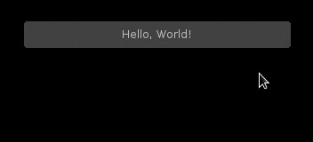
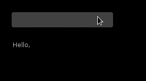
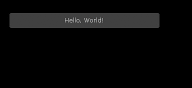
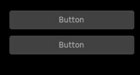
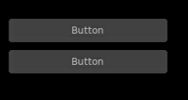

Getting Started
===============

Before actually getting started, it is important to understand the motivation
and mechanics behind SUIT:

- **Immediate mode is better than retained mode**
- **Layout should not care about content**
- **Less is more**

Immediate mode?
---------------

With classical (retained) mode libraries you typically have a stage where you
create the whole UI when the program initializes.  This includes what happens
when events like button presses or slider changes occur.  After that point, the
GUI is expected to not change very much.  This is great for word processors
where the interaction is consistent and straightforward, but bad for games,
where everything changes all the time.

With immediate mode libraries, on the other hand, the GUI is created every
frame from scratch.  Because that would be wasteful, there are no widget
objects.  Instead, widgets are created by functions that react to UI state and
present some data.  Where this data comes from and how it is maintained does
not concern the widget at all.  This is, after all, your job.  This gives great
control over what is shown where and when.  The widget code can be right next
to the code that does what should happen if the widget state changes.  The
layout is also very flexible: adding a widget is one more function call, and if
you want to hide a widget, you simply don't call the corresponding function.

This separation of data and behaviour is great when a lot of stuff is going on,
but takes a bit of time getting used to.

What SUIT is
^^^^^^^^^^^^

SUIT is simple: It provides only a few basic widgets that are important for
games:

- :func:`Buttons <Button>` (including :func:`Image Buttons <ImageButton>`)
- :func:`Text Labels <Label>`
- :func:`Checkboxes <Checkbox>`
- :func:`Text Input <Input>`
- :func:`Value Sliders <Slider>`

SUIT is comfortable: It has a straightforward, yet effective row/column-based
layout engine.

SUIT is adaptable: It is possible to change the color scheme, single drawing
functions for all widget or the whole theme.

SUIT is hackable: Custom widgets can leverage the extensive :doc:`core library
<core>`.

**SUIT is good at games!**

What SUIT is not
^^^^^^^^^^^^^^^^

SUIT is not a complete GUI library: It does not provide dropdowns, table views,
menu bars, modal dialogs, etc.

SUIT is not a complete GUI library: It does not have a markup language or tools
to design a user interface.

SUIT is not a complete GUI library: It does not take control of the runtime.
You have to do everything yourself [1]_.

**SUIT is not good at processing words!**

Hello, World!
-------------

SUITing up is is straightforward: Define your GUI in ``love.update()``, and
draw it in ``love.draw()``::

    suit = require 'suit'

    local show_message = false
    function love.update(dt)
        -- Put a button on the screen. If hit, show a message.
        if suit.Button("Hello, World!", 100,100, 300,30).hit then
            show_message = true
        end

        -- if the button was pressed at least one time, but a label below
        if show_message then
            suit.Label("How are you today?", 100,150, 300,30)
        end
    end

    function love.draw()
        suit.draw()
    end

This will produce this UI:

The two widgets (the button and the label) are each created by a function call
(:func:`suit.Button <Button>` and :func:`suit.Label <Label>`).  The first
argument to a widget function always defines the *payload* of the widget.
Different widgets expect different payloads.
Here, both :func:`suit.Button <Button>` and :func:`suit.Label <Label>` expect a
string.
The last four arguments of a widget function define the position and dimension
of the widget.
The function returns a table that indicates the UI state of the widget.
Here, the state ``hit`` is used to figure out if the mouse was clicked and
released on the button.  See :doc:`Widgets <widgets>` for more info on widget
states.

Mutable state
-------------

Widgets that mutate some state - input boxes, checkboxes and sliders - expect
a table as their payload, e.g.::

    local slider = {value = 1, min = 0, max = 2}
    function love.update(dt)
        suit.Slider(slider, 100,100, 200,20)
        suit.Label(tostring(slider.value), 300,100, 200,20)
    end

The widget function updates the payload when some user interaction occurs.  In
the above example, ``slider.value`` may be changed by the :func:`Slider`
widget.  The value is then shown by a :func:`Label` next to the slider.

Options
-------

You can define optional, well, options after the payload.  Most options affect
how the widget is drawn.  For example, to align the label text to the left::

    local slider = {value = 1, max = 2}
    function love.update(dt)
        suit.Slider(slider, 100,100, 200,30)
        suit.Label(tostring(slider.value), {align = "left"}, 300,100, 200,30)
    end

What options are available and what they are doing depends on the widget and
the theme.  See :doc:`Widgets <widgets>` for more info on widget options.

Keyboard input
--------------

The :func:`Input` widget requires that you forward the ``keypressed`` and
``textinput`` events to SUIT::

    local input = {text = ""}
    function love.update(dt)
        suit.Input(input, 100,100,200,30)
        suit.Label("Hello, "..input.text, {align="left"}, 100,150,200,30)
    end

    -- forward keyboard events
    function love.textinput(t)
        suit.textinput(t)
    end

    function love.keypressed(key)
        suit.keypressed(key)
    end

The :func:`Slider` widget can also react to keyboard input.  The mouse state is
automatically updated, but you can provide your own version of reality if you
need to.  See the :doc:`Core functions <core>` for more details.

Layout
------

It is tedious to calculate the position and size of each widget you want to put
on the screen.  Especially when all you want is to put three buttons beneath
each other.  SUIT implements a simple, yet effective layout engine.  All the
engine does is put cells next to each other (below or right).  It does not care
what you put into those cells, but assumes that you probably need them for
widgets.  Cells are reported by four numbers (left, top, width and height) that
you can directly pass as the final four arguments to the widget functions.
If you have ever dabbled with `Qt's <http://qt.io>`_ ``QBoxLayout``, you
already know 89% [2]_ of what you need to know.

Hello, World! can be rewritten as follows::

    suit = require 'suit'

    local show_message = false
    function love.update(dt)
        -- put the layout origin at position (100,100)
        -- cells will grow down and to the right of the origin
        -- note the colon syntax
        suit.layout:reset(100,100)

        -- put 10 extra pixels between cells in each direction
        suit.layout:padding(10,10)

        -- construct a cell of size 300x30 px and put the button into it
        if suit.Button("Hello, World!", suit.layout:row(300,30)).hit then
            show_message = true
        end

        -- add another cell below the first cell
        -- the size of the cell is the same as the first cell
        if show_message then
            suit.Label("How are you today?", suit.layout:row())
        end
    end

    function love.draw()
        suit.draw()
    end

At the beginning of each frame, the layout origin (and some internal layout
state) has to be reset.  You can also define optional padding between cells.
Cells are added using ``layout:row(w,h)`` (which puts the new cell below the
old cell) and ``layout:col(w,h)`` (which puts the new cell to the right of the
old cell).  If omitted, the width and height of the new cell are copied from
the old cell.  There are also special identifiers that calculate the size from
the sizes of all cells that were created since the last ``reset()``: ``max``,
``min`` and ``median``.  They do what you expect them to do.

It is also possible to nest cells and to let cells dynamically fill the
available space (but you have to tell how much space there is beforehand).
Refer to the :doc:`Layout <layout>` documentation for more information.

Widget ids
----------

Each widget is identified by an ``id`` [4]_. Internally, this ``id`` is used to
figure out which widget should handle user input like mouse clicks and keyboard
presses.
Unless specified otherwise, the ``id`` is the same as the payload, i.e.,
the ``id`` of ``Button("Hello, World!", ...)`` will be the string
``"Hello, World!"``.
In almost all of the cases, this will work fine and you don't have to worry about
this ``id`` business.

Well, almost. Problems arise when two widgets share the same id, like here::

    local suit = require 'suit'

    function love.update()
        suit.layout:reset(100, 100)
        suit.layout:padding(10)

        if suit.Button("Button", suit.layout:row(200, 30)).hit then
            love.graphics.setBackgroundColor(255,255,255)
        end
        if suit.Button("Button", suit.layout:row()).hit then
            love.graphics.setBackgroundColor(0,0,0)
        end
    end

    function love.draw()
        suit:draw()
    end

If the first button is hovered, both buttons will be highlighted, and if it pressed,
both actions will be carried out.
Hovering the second button will not affect the first, and clicking it will highlight
both buttons, but only execute the action of the second button [5]_.

Luckily, there is a fix: you can specify the ``id`` of any widget using the ``id``
option, like so::

    local suit = require 'suit'

    function love.update()
        suit.layout:reset(100, 100)
        suit.layout:padding(10)

        if suit.Button("Button", {id=1}, suit.layout:row(200, 30)).hit then
            love.graphics.setBackgroundColor(255,255,255)
        end
        if suit.Button("Button", {id=2}, suit.layout:row()).hit then
            love.graphics.setBackgroundColor(0,0,0)
        end
    end

    function love.draw()
        suit:draw()
    end

Now, events from one button will not propagate to the other. Here, the both ``id`` s
are numbers, but you can use any Lua value except ``nil`` and ``false``.

Themeing
--------

SUIT lets you customize how any widget (except :func:`ImageButton`) is drawn.
Each widget (except, :func:`you know <ImageButton>`) is drawn by a function in
the table ``suit.theme``.  Conveniently, the name of the function
responsible for drawing a widget is named after it, so, a button is drawn by
the function ``suit.theme.Button``.  If you want to change how a button is
drawn, simply overwrite the function.  If you want to redecorate completely, it
might be easiest to start from scratch and swap the whole table.

However, if you just don't like the colors, the default theme is open to change.
It requires you to change the background (``bg``) and foreground (``fg``) color
of three possible widget states: ``normal``, when nothing out of
the ordinary happened, ``hovered``, when the mouse hovers above a widget, and
``active``, when the mouse hovers above, and the mouse button is pressed (but
not yet released) on the widget.  The colors are saved in the table
``suit.theme.color``.  The default color scheme is this::

    suit.theme.color = {
        normal  = {bg = { 66, 66, 66}, fg = {188,188,188}},
        hovered = {bg = { 50,153,187}, fg = {255,255,255}},
        active  = {bg = {255,153,  0}, fg = {225,225,225}}
    }

You can also do minimally invasive surgery::

    function love.load()
        suit.theme.color.normal.fg = {255,255,255}
        suit.theme.color.hovered = {bg = {200,230,255}, fg = {0,0,0}}
    end

GUI Instances
-------------

Sometimes you might feel the need to separate parts of the GUI.  Maybe certain
UI elements should always be drawn before or after other UI elements, or maybe
you don't want the UI state to "leak" (e.g., from a stacked pause gamestate to
the main gamestate).

For this reason, SUIT allows you to create GUI instances::

    local dress = suit.new()

The IO and layout state of ``dress`` is totally contained in the instance and
does not affect any other instances (including the "global" instance ``suit``).
In particular, ``suit.draw()`` will not draw anything from ``dress``.  Luckily,
you can do that yourself::

    dress:draw()

Notice that instances require that you use the colon syntax.  This is true for
every `core <core>` function as well as the widgets.  To create a button, for
example, you have to write::

    dress:Button("Click?", dress.layout:row())

.. _instance-theme:

Instance Theme
^^^^^^^^^^^^^^

Unlike UI and layout state, themes **are** shared among instances.  The reason
is that the ``suit.theme`` and ``dress.theme`` are **references**, and point to
the same table (unless you make either of them point somewhere else).  Usually
this is a feature, but please still consider this

.. warning::

   Changes in a shared theme will be shared across GUI instances.

If this is an issue---for example because you only want to change the color
scheme of an instance---you can either `deep-copy
<http://hump.readthedocs.org/en/latest/class.html#class:clone>`_ the theme
table or use some metatable magic::

    dress.theme = setmetatable({}, {__index = suit.theme})

    -- NOTE: you have to replace the whole color table. E.g., replacing only
    --       dress.theme.color.normal will also change suit.theme.color.normal!
    dress.theme.color = {
        normal   = {bg = {188,188,188}, fg = { 66, 66, 66}},
        hovered  = {bg = {255,255,255}, fg = { 50,153,187}},
        active   = {bg = {255,255,255}, fg = {225,153,  0}}
    }

    function dress.theme.Label(text, opt, x,y,w,h)
        -- draw the label in a fancier way
    end

.. [1] But it thinks you can handle that.
.. [2] Proportion determined by rigorous scientific experiments [3]_.
.. [3] And theoretic reasoning. Mostly that, actually.
.. [4] Welcome to the tautology club!
.. [5] Immediate mode is to blame: When the second button is processed, the first
       one is already fully evaluated. Time can not be reversed, not even by love.
