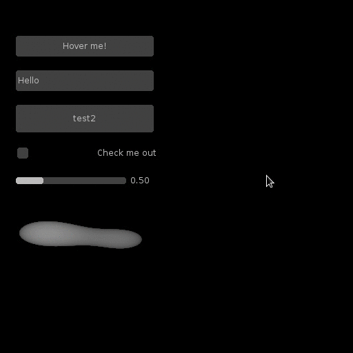

SUIT
====

Simple User Interface Toolkit for `LÖVE <http://love2d.org>`_.

SUIT up
-------

You can download SUIT and view the code on github: `vrld/SUIT
<http://github.com/vrld/SUIT>`_.
You may also download the sourcecode as a `zip
<http://github.com/vrld/SUIT/zipball/master>`_ or `tar
<http://github.com/vrld/SUIT/tarball/master>`_ file.

Otherwise, use `Git <http://git-scm.com>`_::

    git clone git://github.com/vrld/SUIT

Update::

    git pull

Hello, Suit::

    suit = require 'suit'

    local show_message = false
    function love.update(dt)
        -- Put a button on the screen. If hit, show a message.
        if suit.Button("Hello, World!", 100,100, 300,30).hit then
            show_message = true
        end

        -- if the button was pressed at least one time, but a label below
        if show_message then
            suit.Label("How are you today?", 100,150, 300,30)
        end
    end

    function love.draw()
        suit.draw()
    end

Read on
-------

.. toctree::
   :maxdepth: 2

   Getting Started <gettingstarted>
   Widgets <widgets>
   Layout <layout>
   Core Functions <core>
   Themeing <themes>
   License <license>

Example code
------------

The following code will create this UI:

::

    local suit = require 'suit'

    -- generate some assets (below)
    function love.load()
        snd = generateClickySound()
        normal, hovered, active, mask = generateImageButton()
        smallerFont = love.graphics.newFont(10)
    end

    -- data for a slider, an input box and a checkbox
    local slider= {value = 0.5, min = -2, max = 2}
    local input = {text = "Hello"}
    local chk = {text = "Check?"}

    -- all the UI is defined in love.update or functions that are called from here
    function love.update(dt)
        -- put the layout origin at position (100,100)
        -- cells will grown down and to the right from this point
        -- also set cell padding to 20 pixels to the right and to the bottom
        suit.layout:reset(100,100, 20,20)

        -- put a button at the layout origin
        -- the cell of the button has a size of 200 by 30 pixels
        state = suit.Button("Click?", suit.layout:row(200,30))

        -- if the button was entered, play a sound
        if state.entered then love.audio.play(snd) end

        -- if the button was pressed, take damage
        if state.hit then print("Ouch!") end

        -- put an input box below the button
        -- the cell of the input box has the same size as the cell above
        -- if the input cell is submitted, print the text
        if suit.Input(input, suit.layout:row()).submitted then
            print(input.text)
        end

        -- put a button below the input box
        -- the width of the cell will be the same as above, the height will be 40 px
        if suit.Button("Hover?", suit.layout:row(nil,40)).hovered then
            -- if the button is hovered, show two other buttons
            -- this will shift all other ui elements down

            -- put a button below the previous button
            -- the cell height will be 30 px
            -- the label of the button will be aligned top left
            suit.Button("You can see", {align='left', valign='top'}, suit.layout:row(nil,30))

            -- put a button below the previous button
            -- the cell size will be the same as the one above
            -- the label will be aligned bottom right
            suit.Button("...but you can't touch!", {align='right', valign='bottom'},
                                                   suit.layout:row())
        end

        -- put a checkbox below the button
        -- the size will be the same as above
        -- (NOTE: height depends on whether "Hover?" is hovered)
        -- the label "Check?" will be aligned right
        suit.Checkbox(chk, {align='right'}, suit.layout:row())

        -- put a nested layout
        -- the size of the cell will be as big as the cell above or as big as the
        -- nested content, whichever is bigger
        suit.layout:push(suit.layout:row())

            -- change cell padding to 3 pixels in either direction
            suit.layout:padding(3)

            -- put a slider in the cell
            -- the inner cell will be 160 px wide and 20 px high
            suit.Slider(slider, suit.layout:col(160, 20))

            -- put a label that shows the slider value to the right of the slider
            -- the width of the label will be 40 px
            suit.Label(("%.02f"):format(slider.value), suit.layout:col(40))

        -- close the nested layout
        suit.layout:pop()

        -- put an image button below the nested cell
        -- the size of the cell will be 200 by 100 px,
        --      but the image may be bigger or smaller
        -- the button shows the image `normal' when the button is inactive
        -- the button shows the image `hovered` if the mouse is over an opaque pixel
        --      of the ImageData `mask`
        -- the button shows the image `active` if the mouse is above an opaque pixel
        --      of the ImageData `mask` and the mouse button is pressed
        -- if `mask` is omitted, the alpha-test will be swapped for a test whether
        --      the mouse is in the area occupied by the widget
        suit.ImageButton(normal, {mask = mask, hovered = hovered, active = active}, suit.layout:row(200,50))

        -- if the checkbox is checked, display a precomputed layout
        if chk.checked then
            -- the precomputed layout will be 3 rows below each other
            -- the origin of the layout will be at (400,100)
            -- the minimal height of the layout will be 300 px
            rows = suit.layout:rows{pos = {400,100}, min_height = 300,
                {200, 30},    -- the first cell will measure 200 by 30 px
                {30, 'fill'}, -- the second cell will be 30 px wide and fill the
                              -- remaining vertical space between the other cells
                {200, 30},    -- the third cell will be 200 by 30 px
            }

            -- the first cell will contain a witty label
            -- the label will be aligned left
            -- the font of the label will be smaller than the usual font
            suit.Label("You uncovered the secret!", {align="left", font = smallerFont},
                                                    rows.cell(1))

            -- the third cell will contain a label that shows the value of the slider
            suit.Label(slider.value, {align='left'}, rows.cell(3))

            -- the second cell will show a slider
            -- the slider will operate on the same data as the first slider
            -- the slider will be vertical instead of horizontal
            -- the id of the slider will be 'slider two'. this is necessary, because
            --     the two sliders should not both react to UI events
            suit.Slider(slider, {vertical = true, id = 'slider two'}, rows.cell(2))
        end
    end

    function love.draw()
        -- draw the gui
        suit.draw()
    end

    function love.textinput(t)
        -- forward text input to SUIT
        suit.textinput(t)
    end

    function love.keypressed(key)
        -- forward keypressed to SUIT
        suit.keypressed(key)
    end

    -- generate assets (see love.load)
    function generateClickySound()
        local snd = love.sound.newSoundData(512, 44100, 16, 1)
        for i = 0,snd:getSampleCount()-1 do
            local t = i / 44100
            local s = i / snd:getSampleCount()
            snd:setSample(i, (.7*(2*love.math.random()-1) + .3*math.sin(t*9000*math.pi)) * (1-s)^1.2 * .3)
        end
        return love.audio.newSource(snd)
    end

    function generateImageButton()
        local metaballs = function(t, r,g,b)
            return function(x,y)
                local px, py = 2*(x/200-.5), 2*(y/100-.5)
                local d1 = math.exp(-((px-.6)^2 + (py-.1)^2))
                local d2 = math.exp(-((px+.7)^2 + (py+.1)^2) * 2)
                local d = (d1 + d2)/2
                if d > t then
                    return r,g,b, ((d-t) / (1-t))^.2
                end
                return 0,0,0,0
            end
        end

        local normal, hovered, active = love.image.newImageData(200,100), love.image.newImageData(200,100), love.image.newImageData(200,100)
        normal:mapPixel(metaballs(.48, .74,.74,.74))
        hovered:mapPixel(metaballs(.46, .2,.6,.6))
        active:mapPixel(metaballs(.43, 1,.6,0))
        return love.graphics.newImage(normal), love.graphics.newImage(hovered), love.graphics.newImage(active), normal
    end

Indices and tables
------------------

* :ref:`genindex`
* :ref:`modindex`
* :ref:`search`
